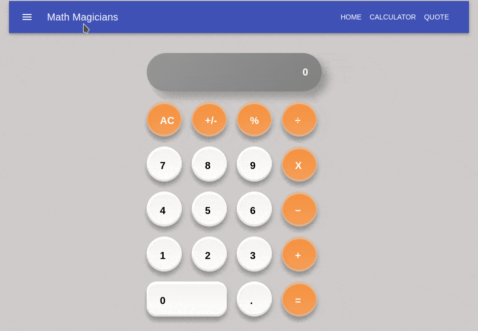

# React Calculator

> This is a real calculator made using react

Additional description about the project and its features.



## Built With

- React
- React-DOM
- [create-react-app](https://github.com/facebook/create-react-app)
- npm
- CSS3
- ES6
- Jest
- Material UI
- Big.js

## Live Demo

[Live Demo Link](https://react-calculator-g.herokuapp.com/)

## Getting Started

In order to run locally this project type the following commands over the terminal in Linux or Mac or the Windows cmd console:

```s
$ git clone https://github.com/myshine112/React-calculator.git
$ cd React-calculator
$ npm install
$ npm start

```

Open `http://localhost:3000` to view running project in the browser.

## Test

To run the integration Tests locally using [Jest](https://jestjs.io/), just type the following commands over the terminal in Linux or Mac or the Windows cmd console:

```s
$ npm test

```
